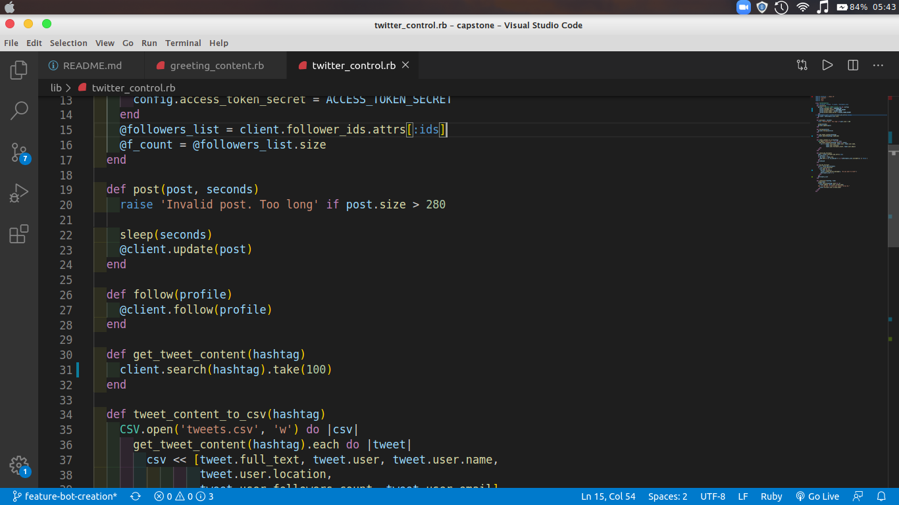

# Ruby-Capstone-Project

<!--
*** Thanks for checking out this README Template. If you have a suggestion that would
*** make this better, please fork the repo and create a pull request or simply open
*** an issue with the tag "enhancement".
*** Thanks again! Now go create something AMAZING! :D
-->

<!-- PROJECT SHIELDS -->
<!--
*** I'm using markdown "reference style" links for readability.
*** Reference links are enclosed in brackets [ ] instead of parentheses ( ).
*** See the bottom of this document for the declaration of the reference variables
*** for contributors-url, forks-url, etc. This is an optional, concise syntax you may use.
*** https://www.markdownguide.org/basic-syntax/#reference-style-links
-->
[![Contributors][contributors-shield]][contributors-url]
[![Forks][forks-shield]][forks-url]
[![Stargazers][stars-shield]][stars-url]
[![Issues][issues-shield]][issues-url]

<!-- PROJECT LOGO -->
 

  

  <h3 align="center">Twitter bot</h3>

  

    This is the Capstone Project for the Ruby section of the Microverse curriculum.
     
    <a href="https://github.com/expjazz/ruby-capstone"><strong>Explore the docs »</strong></a>
     
     
    <a href="https://github.com/expjazz/ruby-capstone/issues">Report Bug</a>
    ·
    <a href="https://github.com/expjazz/ruby-capstone/issues">Request Feature</a>
  

<!-- TABLE OF CONTENTS -->
## Table of Contents

* [About the Project](#about-the-project)
  * [Built With](#built-with)
* [Contact](#Authors)
* [Acknowledgements](#acknowledgements)
* [What can it do](#What-can-it-do)

## About the project

Capstone projects are solo projects at the end of the each of the Microverse Main Technical Curriculum sections. It is a real-world-like project built with business specifications This project was at the end of the Ruby curriculum section. I was asked to create a twitter bot with Ruby. I chose to create a bot to make the life of a business owner easier by running his twitter account during the day. My bot makes different tweets during the day, such as informing about the Covid-19 status, offering new promotions, giving informational articles, tracking new followers, sending welcoming messages for them and many features more. 

## Video Description

- Here is a brief video explaining the features of the project.

[Video](https://www.loom.com)

## Built With

- Ruby
- VScode
- Twitter API
- Rspec

## Live Demo

[Live Demo Link](https://repl.it/@expjazz/ruby-capstone)

### Instalation

### Getting a green light from Twitter

In order to test the Twitterbot you will need to apply for a [Twitter Developer](https://developer.twitter.com/en). Once you've gotten the confirmation email, create an app and give the permission to access your profile [instructions here](https://developer.twitter.com/en/apply-for-access). Don't forget to save it's API token somewhere (dont share with other people, it is supposed to be unique). You will need the token in order to test the bot.

### Setup

In order to test the bot, you do need to have Ruby (at least 2.5) and Rspec installed.

#### Installation

### Install

To test the bot locally, clone the repository, navigate to it's containing directory, and run:

#### Clone the repository and follow the steps to run the bot.

- $ `git clone https://github.com/expjazz/ruby-capstone.git`
- $  bundle install    -> run this command to install the required gems
- $  bin/main.rb       -> run this command to run the program
- $  gem install rspec -> run this command to install rspec 
- $  rspec             ->run this command to test the program with rspec

### Details 

First, fork the repo in your local machine and then run the user_keys.rb. Then, paste on the terminal your respective keys. Then, while still on the terminal, type in 'bin/main.rb' and see the magic happens.

## What can it do

- It makes differents types of tweeds during a cicle:
 About Covid-19 status, offering promotions, giving inspirational quotes, educational
 articles about a input-given-subject, greetings that vary acording the time of day and temperature.
 - It search for new followers and sends welcoming direct-messages to them 
 - It searchs for a hashtag and repply to every tweet in that hashtag following the users
 - It store information about the users that tweeted in the searched hashtag (for marketing purposes)

## Author

👤 **Expedito Andrade**

- Github: [@githubexpjazz](https://github.com/expjazz)
- Twitter: [@expjazz](https://twitter.com/expeditoandrade13)
- Linkedin: [Expedito Andrade](https://www.linkedin.com/in/expedito-andrade-3645151a4/)
- Email: (expeditojazz@gmail.com)

## 🤝 Contributing

Contributions, issues and feature requests are welcome!

Feel free to check the [issues page](issues/).

## Show your support

Give a ⭐️ if you like this project!

## Credits

- Design Created by Mather Njuguna and Sam Achola on behance.
- See the Design Template on behance

## 📝 License

This project is [MIT](./LICENSE) licensed.
